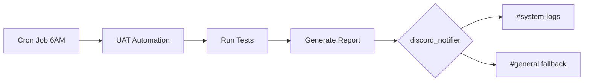

# UAT Discord Integration - Setup Complete

## Status: ✅ READY

The UAT system is now fully integrated with your existing Discord/Hermes setup.

## What Was Configured

### ✅ Using Existing Discord Service

The UAT automation now uses your existing `backend/services/discord_notifier.py` service:

- **Bot Token**: Uses `DISCORD_BOT_TOKEN` from your `.env`
- **Channel**: Sends to `#system-logs` (falls back to `#general`)
- **Format**: Rich embeds with scores and status

### ✅ Environment Variables (Already Set)

From your `.env` file:
```bash
DISCORD_BOT_TOKEN=<your-discord-bot-token>
DISCORD_CHANNEL_SYSTEM_LOGS=1481294557936353521
DISCORD_CHANNEL_GENERAL=1481294687607455764
```

### ✅ Notification Format

When UAT runs, you'll see in Discord:

```
✅ UAT Report - CBB Edge
Daily automated testing completed for https://your-app.railway.app

🎽 Elite FM Score: 8.2/10 | 📊 Quant Score: 7.4/10 | ⚠️ Critical Issues: 2

📁 Full Report: View at: reports/uat/latest_summary.md
```

Colors:
- 🟢 Green: Both scores ≥ 8.0
- 🟡 Yellow: Both scores ≥ 6.0
- 🔴 Red: Either score < 6.0

## How to Test

### Option 1: Quick Test (Recommended)
```bash
cd /mnt/c/Users/sfgra/repos/Fixed/cbb-edge
python scripts/test_uat_discord.py
```

This sends a test notification to verify everything works.

### Option 2: Full UAT Run
```bash
cd /mnt/c/Users/sfgra/repos/Fixed/cbb-edge
export UAT_BASE_URL="https://your-app.railway.app"
export UAT_API_KEY="your_api_key"
./scripts/run_uat.sh
```

## How It Works



1. **Cron triggers** at 6:00 AM daily
2. **UAT automation** runs tests using Playwright
3. **Report generated** with Elite FM and Quant scores
4. **Discord notifier** sends embed to system-logs channel
5. **Fallback** to general channel if system-logs unavailable

## Files Modified

| File | Change |
|------|--------|
| `scripts/uat_automation.py` | Updated to use `discord_notifier` service |
| `scripts/run_uat.sh` | Simplified notification handling |
| `scripts/test_uat_discord.py` | New test script (created) |

## Channels Used

| Channel | Purpose | Channel ID |
|---------|---------|------------|
| `#system-logs` | Primary UAT notifications | 1481294557936353521 |
| `#general` | Fallback notifications | 1481294687607455764 |

## Troubleshooting

### No notifications received?

1. **Test the connection**:
   ```bash
   python scripts/test_uat_discord.py
   ```

2. **Check bot is in server**:
   - Verify the bot is a member of your Discord server
   - Check it has `Send Messages` and `Embed Links` permissions

3. **Verify channel IDs**:
   ```bash
   env | grep DISCORD_CHANNEL
   ```

4. **Check bot token**:
   ```bash
   env | grep DISCORD_BOT_TOKEN
   ```

### Test notification failed?

Run the diagnostic:
```bash
python scripts/test_uat_discord.py
```

This will show:
- ✅ Which env vars are set
- ✅ If discord_notifier imports correctly
- ✅ If bot token is accessible
- ✅ Test notification result

## Next Steps

1. ✅ Run test: `python scripts/test_uat_discord.py`
2. ✅ Wait for 6:00 AM tomorrow (automated run)
3. ✅ Or run manually: `./scripts/run_uat.sh`
4. ✅ Check Discord for notification

## Integration Complete ✅

Your UAT system is now:
- ✅ Scheduled to run daily at 6 AM
- ✅ Integrated with existing Discord bot
- ✅ Sending rich embed notifications
- ✅ Ready to monitor application quality

The system will automatically evaluate your application from both **Elite Fantasy Manager** and **Quant Trading** perspectives and report the results to your Discord channels.
