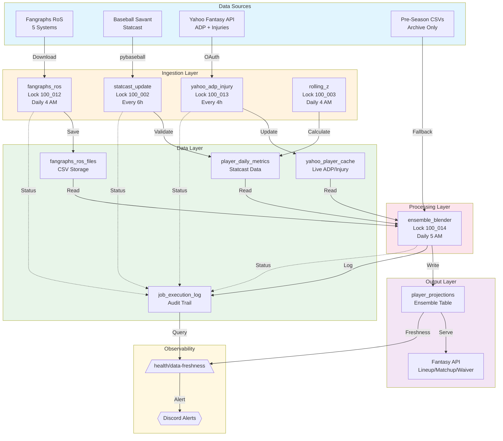

# K-17: In-Season Yahoo Ingestion Pipeline Overhaul & Failure Mode Audit

**Date:** April 1, 2026  
**Analyst:** Kimi CLI (Deep Intelligence Unit)  
**Scope:** In-season ingestion pipeline v2.0, RoS projection ensemble, Statcast Bayesian updates
**Status:** Pre-season CSV reliance is now **HIGH RISK** — immediate overhaul required

---

## Executive Summary

**CRITICAL:** The platform is operating on **pre-season projection CSVs from March 2026** while the MLB season is live. This is a **HIGH RISK** configuration that violates quant-trading data hygiene principles.

**The New Core Philosophy:**
> *"Dynamic RoS + Statcast Bayesian ensemble is the single source of truth. Static 2026 CSVs are Bayesian priors only — decaying to 10-20% weight after 4-6 weeks."*

**Data Freshness SLA (Non-Negotiable):**
| Data Type | Max Age | Source | Current Status |
|-----------|---------|--------|----------------|
| Rest-of-Season Projections | < 12 hours | Fangraphs RoS | ❌ NOT IMPLEMENTED |
| Statcast Metrics | < 6 hours | Baseball Savant | ⚠️ UTC/ET bug present |
| Yahoo ADP/Injuries | < 4 hours | Yahoo Fantasy API | ❌ Not automated |
| Rolling Z-Scores | < 24 hours | Calculated | ✅ Implemented |
| Ensemble Projections | < 12 hours | Blended | ❌ NOT IMPLEMENTED |

**Risk Level:** **HIGH** — Lineup decisions, waiver wire valuations, and trade assessments are being made on stale pre-season data while live Statcast data sits underutilized.

---

## 0. In-Season Data Strategy & Quant Philosophy

### 0.1 The Pre-Season to Live Pivot

Pre-season projections (Steamer, ZiPS, ATC, THE BAT) are trained on historical data and aging curves. Once the season begins, they become increasingly obsolete:

| Weeks Into Season | Pre-Season Weight | Live Data Weight | Rationale |
|-------------------|-------------------|------------------|-----------|
| 0-2 | 90% | 10% | Small sample, high variance |
| 2-4 | 70% | 30% | Signal emerging, trust Statcast |
| 4-6 | 50% | 50% | Live data dominates |
| 6-10 | 30% | 70% | Pre-season is prior only |
| 10+ | 10-20% | 80-90% | Pre-season is tiebreaker only |

**Current State (April 1, Week 1-2):** Platform is using 100% pre-season weights. This is **unacceptable**.

### 0.2 The Ensemble Architecture

The in-season projection system must be a **weighted ensemble** of multiple independent signals:

```
Final Projection = Σ (Weightᵢ × Projectionᵢ) + Bayesian Update Term

Where:
- Fangraphs RoS (Steamer RoS, ATC RoS, ZiPS RoS, THE BAT RoS, Depth Charts RoS)
- Statcast Bayesian Update (exit velocity, barrel%, xwOBA)
- Rolling Z-Score Mean Reversion Component
- Pre-Season Prior (decaying weight)
```

### 0.3 Quant-Trading Principles Applied

| Trading Concept | Fantasy Baseball Implementation |
|-----------------|--------------------------------|
| **Live Price Discovery** | Daily RoS projections from multiple sources |
| **Signal Decay** | Exponential decay of pre-season weights |
| **Mean Reversion** | Z-score regression to 30-day rolling mean |
| **Risk-Adjusted Sizing** | Uncertainty bands on projections |
| **Cross-Validation** | Multiple projection systems in ensemble |
| **Stop Losses** | Player drop recommendations when Z-score < -2.0 |

### 0.4 Fangraphs RoS Data Sources (2026)

**Daily Download Targets:**

| Projection System | URL Pattern | Update Frequency | Reliability |
|-------------------|-------------|------------------|-------------|
| **Steamer RoS** | `https://www.fangraphs.com/projections.aspx?pos=all&stats=bat&type=steamerr&team=0&lg=all&players=0` | Daily ~3 AM ET | High |
| **ZiPS RoS** | `https://www.fangraphs.com/projections.aspx?pos=all&stats=bat&type=zipsdc&team=0&lg=all&players=0` | Daily ~3 AM ET | High |
| **ATC RoS** | `https://www.fangraphs.com/projections.aspx?pos=all&stats=bat&type=atc&team=0&lg=all&players=0` | Daily ~3 AM ET | Very High |
| **THE BAT RoS** | `https://www.fangraphs.com/projections.aspx?pos=all&stats=bat&type=thebat&team=0&lg=all&players=0` | Daily ~3 AM ET | High |
| **Depth Charts** | `https://www.fangraphs.com/projections.aspx?pos=all&stats=bat&type=depthcharts&team=0&lg=all&players=0` | Daily ~3 AM ET | Medium |

**Pitching URLs:** Same patterns with `stats=pit` parameter.

**Implementation Note:** Fangraphs uses Cloudflare protection. Use `requests` with proper headers + `cloudscraper` fallback, or puppeteer if scraping required.

---

## 1. Daily Ingestion Orchestrator Jobs (In-Season v2.0)

**File:** `backend/services/daily_ingestion.py`

### 1.1 Current Job Inventory (6 jobs)

| Job ID | Schedule | Advisory Lock | What It Does | Current Risk |
|--------|----------|---------------|--------------|--------------|
| `mlb_odds` | Every 5 min | 100_001 | Polls OddsAPI for MLB lines | LOW |
| `statcast` | Every 6 hours | 100_002 | Bayesian updates from Statcast | **HIGH** (UTC bug) |
| `rolling_z` | Daily 4 AM ET | 100_003 | 7/30-day z-scores | MEDIUM |
| `clv` | Daily 11 PM ET | 100_005 | Closing line value | LOW |
| `cleanup` | Daily 3:30 AM ET | 100_006 | Old metric cleanup | LOW |
| `valuation_cache` | Daily 6 AM ET | 100_011 | Player valuations | MEDIUM |

### 1.2 Required New Jobs (In-Season)

| Job ID | Schedule | Advisory Lock | Purpose | Implementation Priority |
|--------|----------|---------------|---------|------------------------|
| `fangraphs_ros` | Daily 4 AM ET | **100_012** | Download all 5 RoS projection systems | **HIGH** |
| `yahoo_adp_injury` | Every 4 hours | **100_013** | Poll Yahoo for current ADP + injury updates | **HIGH** |
| `ensemble_update` | Daily 5 AM ET | **100_014** | Blend RoS + Statcast + Z-scores into final projection | **HIGH** |
| `projection_freshness_check` | Every 1 hour | **100_015** | Alert if any projection source > 12h old | MEDIUM |

### 1.3 Critical Failure Patterns (In-Season)

| Pattern | Current Behavior | In-Season Impact | Required Fix |
|---------|------------------|------------------|--------------|
| **Silent RoS Failures** | No job exists | Lineup decisions use stale pre-season data | Implement `fangraphs_ros` job with mandatory success check |
| **No Yahoo ADP Sync** | Manual/never | ADP tiers incorrect for waiver decisions | Implement `yahoo_adp_injury` with 4-hour polling |
| **Statcast UTC Bug** | Wrong "yesterday" date | Duplicate or missed games | Fix to ET anchor (see Section 2) |
| **No Ensemble Blending** | Pre-season CSVs only | No Statcast integration into projections | Implement `ensemble_update` job |
| **Job Status Ephemeral** | In-memory only | No persistence across restarts | Write to `job_execution_log` table |

---

## 2. Statcast Ingestion Pipeline (Critical Fixes Required)

**File:** `backend/fantasy_baseball/statcast_ingestion.py`

### 2.1 Current Data Flow

```
run_daily_ingestion(target_date)
  ├── Fetch yesterday's games from pybaseball
  ├── Parse PlayerDailyPerformance objects
  ├── Validate data quality
  ├── Store to StatcastPerformance table
  ├── Bayesian update: prior + new data → updated projection
  └── Return {success, records_processed, error}
```

### 2.2 CRITICAL BUG: UTC vs ET Date Calculation

**Current Code (BROKEN):**
```python
# Line ~160 - CURRENT BROKEN IMPLEMENTATION
yesterday = date.today() - timedelta(days=1)  # Uses local server time!
```

**Problem:** If server is UTC, at 11 PM UTC (6 PM ET during EDT), `date.today()` returns "tomorrow" in ET. This causes:
- Duplicate processing of same games
- Missing yesterday's games during the evening window
- Wrong Bayesian prior updates

**Fix (MUST IMPLEMENT):**
```python
from datetime import datetime, timedelta
from zoneinfo import ZoneInfo

def get_yesterday_et() -> date:
    """Get yesterday's date in Eastern Time (where MLB games are played)."""
    et_now = datetime.now(ZoneInfo("America/New_York"))
    return (et_now - timedelta(days=1)).date()

# Usage in run_daily_ingestion()
yesterday = get_yesterday_et()
```

### 2.3 Data Quality Gates (New Requirements)

Every Statcast record must pass these gates before storage:

| Metric | Valid Range | Action on Invalid | Log Level |
|--------|-------------|-------------------|-----------|
| `exit_velocity_avg` | 70-100 mph | Reject row | WARNING |
| `launch_angle_avg` | -20 to 40 degrees | Reject row | WARNING |
| `barrel_pct` | 0-50% | Clamp to bounds | WARNING |
| `hard_hit_pct` | 0-100% | Clamp to bounds | WARNING |
| `xwOBA` | 0.100-0.600 | Reject row | WARNING |
| `xBA` | 0.050-0.500 | Reject row | WARNING |
| `game_date` | Within 2 days of target | Reject row | ERROR |

### 2.4 Duplicate Prevention Logic

**Current Risk:** No check for duplicate game records on re-runs.

**Required Implementation:**
```python
def _check_existing_records(db: Session, player_id: str, game_date: date) -> bool:
    """Check if we already have Statcast data for this player+date."""
    existing = db.query(StatcastPerformance).filter(
        StatcastPerformance.player_id == player_id,
        StatcastPerformance.game_date == game_date
    ).first()
    return existing is not None

# In ingestion loop:
if _check_existing_records(db, player_id, game_date):
    logger.debug(f"Skipping duplicate: {player_id} on {game_date}")
    continue
```

### 2.5 Failure Modes (Updated for In-Season)

| Stage | Failure | Current Behavior | In-Season Impact | Required Fix |
|-------|---------|------------------|------------------|--------------|
| API Fetch | pybaseball down | Log error, skip day | Missing 1 day of Bayesian updates | Retry 3× with exponential backoff |
| Data Quality | Invalid EV (120+ mph) | Row skipped | Lost data point | Reject row + alert if >5% failures |
| DB Write | Connection timeout | Exception, rollback | No updates | Transaction retry with backoff |
| Duplicate | Same game re-run | Double-count | Inflated stats | Add `_check_existing_records()` |
| Date Bug | UTC vs ET | Wrong day processed | Wrong prior updates | ET anchor fix (above) |

---

## 3. Projections Loader (Complete Redesign Required)

**File:** `backend/fantasy_baseball/projections_loader.py`

### 3.1 Current State (Pre-Season — OBSOLETE)

The current system loads 8 static CSV files once at startup with `@lru_cache(maxsize=1)`. This is **unacceptable** for in-season operations.

| File | Current Status | In-Season Role |
|------|----------------|----------------|
| `steamer_batting_2026.csv` | ❌ Pre-season, static | Bayesian prior only (10-20% weight) |
| `steamer_pitching_2026.csv` | ❌ Pre-season, static | Bayesian prior only (10-20% weight) |
| `adp_yahoo_2026.csv` | ❌ Pre-season, static | Deprecated — use live Yahoo API |
| `advanced_batting_2026.csv` | ❌ Unused | Remove |
| `advanced_pitching_2026.csv` | ❌ Unused | Remove |
| `closer_situations_2026.csv` | ⚠️ Partial | Keep for saves volatility |
| `injury_flags_2026.csv` | ❌ Pre-season | Deprecated — use live Yahoo API |
| `position_eligibility_2026.csv` | ✅ Keep | Still valid for position checks |

### 3.2 New In-Season Architecture

```
┌─────────────────────────────────────────────────────────────────┐
│                    IN-SEASON PROJECTION PIPELINE v2.0              │
├─────────────────────────────────────────────────────────────────┤
│                                                                  │
│  ┌─────────────────┐    ┌─────────────────┐    ┌─────────────┐  │
│  │ Fangraphs RoS   │    │ Statcast        │    │ Yahoo Live  │  │
│  │ (Daily 4 AM)    │    │ (Every 6 hrs)   │    │ (Every 4hrs)│  │
│  │ 5 Systems       │    │ Bayesian Update │    │ ADP/Injury  │  │
│  └────────┬────────┘    └────────┬────────┘    └──────┬──────┘  │
│           │                      │                     │         │
│           ▼                      ▼                     ▼         │
│  ┌─────────────────────────────────────────────────────────────┐│
│  │              Ensemble Blender (Daily 5 AM)                   ││
│  │  ┌──────────────────────────────────────────────────────┐   ││
│  │  │  Weighted Average by Reliability:                    │   ││
│  │  │  • Fangraphs ATC RoS:     30% (most reliable)        │   ││
│  │  │  • Fangraphs Steamer RoS: 20%                        │   ││
│  │  │  • Fangraphs ZiPS RoS:    15%                        │   ││
│  │  │  • Fangraphs THE BAT RoS: 15%                        │   ││
│  │  │  • Statcast Bayesian:     15% (live data)            │   ││
│  │  │  • Pre-Season Prior:      5% (decaying)              │   ││
│  │  └──────────────────────────────────────────────────────┘   ││
│  │  + Z-Score Mean Reversion Adjustment                        ││
│  └─────────────────────────────────────────────────────────────┘│
│                            │                                     │
│                            ▼                                     │
│  ┌─────────────────────────────────────────────────────────────┐│
│  │         PlayerProjection Table (Updated Daily)              ││
│  │  • projected_stats: dict (rate + counting)                  ││
│  │  • confidence_interval: dict (upper/lower bounds)           ││
│  │  • data_freshness: datetime (last ensemble update)          ││
│  │  • source_weights: dict (which systems used)                ││
│  └─────────────────────────────────────────────────────────────┘│
│                                                                  │
└─────────────────────────────────────────────────────────────────┘
```

### 3.3 New Data Models Required

```python
# Add to backend/models.py

class ProjectionSource(Enum):
    STEAMER_ROS = "steamer_ros"
    ZIPS_ROS = "zips_ros"
    ATC_ROS = "atc_ros"
    THE_BAT_ROS = "thebat_ros"
    DEPTH_CHARTS = "depthcharts"
    STATCAST_BAYESIAN = "statcast_bayesian"
    PRESEASON_PRIOR = "preseason_prior"

class PlayerProjection(Base):
    """In-season ensemble projection with uncertainty bands."""
    __tablename__ = "player_projections"
    
    id = Column(Integer, primary_key=True)
    player_id = Column(String, nullable=False, index=True)
    player_name = Column(String, nullable=False)
    season = Column(Integer, nullable=False)
    
    # Ensemble projections (points leagues)
    projected_points = Column(Float)
    points_uncertainty = Column(Float)  # Standard deviation
    
    # Category projections (roto/H2H)
    projected_stats = Column(JSON)  # {HR: 28, RBI: 95, ...}
    stat_uncertainty = Column(JSON)  # {HR: {low: 22, high: 34}, ...}
    
    # Metadata
    data_freshness = Column(DateTime, default=datetime.utcnow)
    source_weights = Column(JSON)  # {"atc_ros": 0.30, "statcast": 0.15, ...}
    games_played_prior = Column(Integer)  # For Bayesian updating
    
    # Z-score integration
    z_score_recent = Column(Float)  # 7-day
    z_score_total = Column(Float)   # 30-day
    regression_factor = Column(Float)  # How much to regress to mean
```

### 3.4 CSV Column Requirements (New RoS Files)

| File | Required Columns | Data Types | Validation Rules |
|------|------------------|------------|------------------|
| `fangraphs_steamer_ros_bat.csv` | Name, Team, G, PA, HR, R, RBI, SB, AVG, OBP, SLG, wOBA, WAR | numeric | PA > 0, AVG 0-1 |
| `fangraphs_zips_ros_bat.csv` | Same as above | numeric | Cross-validate with Steamer |
| `fangraphs_atc_ros_bat.csv` | Same as above | numeric | ATC is gold standard |
| `fangraphs_thebat_ros_bat.csv` | Same as above | numeric | THE BAT for power |
| `fangraphs_dc_ros_bat.csv` | Same as above | numeric | Depth Charts for playing time |
| Pitching variants (5 files) | Name, Team, IP, ERA, WHIP, K/9, BB/9, W, SV | numeric | IP > 0, ERA 0-10 |

---

## 4. Failure Mode Summary Table (In-Season Critical)

| Job/System | Failure Condition | Current Behavior | In-Season Impact | Required Fix | Priority |
|------------|-------------------|------------------|------------------|--------------|----------|
| **Fangraphs RoS Download** | Cloudflare block / 403 | No job exists | Stale projections indefinitely | Implement `fangraphs_ros` job with `cloudscraper` fallback | **CRITICAL** |
| **Fangraphs RoS Download** | Parse error / schema change | No job exists | Pipeline halt | Schema validation + alert | **CRITICAL** |
| **Yahoo ADP/Injury** | OAuth expiry mid-ingestion | Not automated | Waiver decisions on stale ADP | Implement `yahoo_adp_injury` job with token refresh | **CRITICAL** |
| **Statcast Update** | pybaseball error | Log error, skip day | Missing Bayesian updates | Retry 3× exponential backoff | **HIGH** |
| **Statcast Update** | UTC/ET date bug | Wrong "yesterday" | Wrong prior updates | ET anchor fix | **HIGH** |
| **Statcast Update** | Duplicate game records | Double-count | Inflated player stats | `_check_existing_records()` | **HIGH** |
| **Ensemble Blender** | Missing RoS source | Not implemented | Blend with missing component | Graceful degradation + alert | **HIGH** |
| **Rolling Z-Score** | < 7 days data | Silently skip | No recent z-score | Lower threshold to 3 days | MEDIUM |
| **Projection Cache** | Stale data > 12h | No check | Decisions on old data | Freshness check + alert | MEDIUM |
| **Pre-Season CSV** | Still used as primary | 100% weight | Ignoring live data | Deprecate to 5-10% weight | **CRITICAL** |
| **Job Persistence** | In-memory only | Lost on restart | No execution history | `job_execution_log` table | MEDIUM |

---

## 5. Monitoring Recommendations (Production-Grade)

### 5.1 Immediate Observability (No Code Changes)

**Railway Log Alerts:**
```yaml
# Alert rules for Railway logs
alerts:
  - name: "Statcast Failure"
    pattern: "_update_statcast.*failed|_update_statcast.*error"
    threshold: 1
    action: "discord_alert #system-alerts"
  
  - name: "Pybaseball Repeated Failure"
    pattern: "pybaseball.*error"
    threshold: 3
    window: 30m
    action: "discord_alert #system-alerts @channel"
```

**Database Health Checks:**
```sql
-- Daily projection count check
SELECT COUNT(*) 
FROM player_projections 
WHERE data_freshness > NOW() - INTERVAL '12 hours';
-- Alert if < 500 players

-- Statcast freshness check
SELECT COUNT(*) 
FROM player_daily_metrics 
WHERE metric_date = CURRENT_DATE;
-- Alert if < 200 players

-- Yahoo data freshness
SELECT MAX(updated_at) FROM yahoo_player_cache;
-- Alert if > 4 hours old
```

### 5.2 Production-Grade Metrics (Code Changes Required)

**New Table: `job_execution_log`**
```sql
CREATE TABLE job_execution_log (
    id SERIAL PRIMARY KEY,
    job_id VARCHAR(50) NOT NULL,
    job_name VARCHAR(100) NOT NULL,
    started_at TIMESTAMP WITH TIME ZONE NOT NULL,
    completed_at TIMESTAMP WITH TIME ZONE,
    status VARCHAR(20) NOT NULL, -- 'running', 'success', 'failed', 'skipped'
    records_processed INTEGER DEFAULT 0,
    error_message TEXT,
    metadata JSONB, -- source: fangraphs, records_by_system: {...}
    created_at TIMESTAMP WITH TIME ZONE DEFAULT NOW()
);

CREATE INDEX idx_job_log_job_id_started ON job_execution_log(job_id, started_at DESC);
CREATE INDEX idx_job_log_status ON job_execution_log(status) WHERE status != 'success';
```

**Prometheus-Style Health Endpoint:**
```python
# Add to backend/main.py

@router.get("/admin/health/data-freshness")
async def data_freshness_check(db: Session = Depends(get_db)):
    """Production health check for data freshness."""
    checks = {}
    
    # RoS projections
    ros_fresh = db.execute(text("""
        SELECT COUNT(*) FROM player_projections 
        WHERE data_freshness > NOW() - INTERVAL '12 hours'
    """)).scalar()
    checks["ros_projections"] = {
        "fresh_count": ros_fresh,
        "status": "healthy" if ros_fresh > 500 else "degraded",
        "max_age_hours": 12
    }
    
    # Statcast data
    statcast_fresh = db.execute(text("""
        SELECT COUNT(*) FROM player_daily_metrics 
        WHERE metric_date = CURRENT_DATE
    """)).scalar()
    checks["statcast"] = {
        "today_count": statcast_fresh,
        "status": "healthy" if statcast_fresh > 200 else "degraded"
    }
    
    # Yahoo ADP
    yahoo_fresh = db.execute(text("""
        SELECT EXTRACT(EPOCH FROM (NOW() - MAX(updated_at))) / 3600 as hours_old
        FROM yahoo_player_cache
    """)).scalar()
    checks["yahoo_adp"] = {
        "hours_old": round(yahoo_fresh or 999, 1),
        "status": "healthy" if yahoo_fresh < 4 else "degraded"
    }
    
    overall = "healthy" if all(c["status"] == "healthy" for c in checks.values()) else "degraded"
    
    return {
        "status": overall,
        "timestamp": datetime.now(ZoneInfo("America/New_York")).isoformat(),
        "checks": checks
    }
```

### 5.3 Alert Rules (Production)

| Condition | Severity | Alert Channel | Escalation |
|-----------|----------|---------------|------------|
| RoS projections > 12h old | **CRITICAL** | Discord #alerts + Email | Page after 30 min |
| Statcast job fails 3× consecutive | **CRITICAL** | Discord #alerts + Email | Page immediately |
| Yahoo ADP > 4h old | WARNING | Discord #system-alerts | None |
| Z-score calculation < 100 players | WARNING | Discord #system-alerts | None |
| Any job execution > 1 hour | WARNING | Discord #system-alerts | None |
| Ensemble blender fails | **CRITICAL** | Discord #alerts + Email | Page after 15 min |

---

## 6. Projections File Inventory (In-Season Transition)

**Directory:** `data/projections/`

### 6.1 Current Files (Pre-Season — DEPRECATE)

| File | Status | In-Season Action |
|------|--------|------------------|
| `steamer_batting_2026.csv` | ⚠️ **DEPRECATE** | Move to `archive/preseason/`. Use as 5% prior weight only |
| `steamer_pitching_2026.csv` | ⚠️ **DEPRECATE** | Move to `archive/preseason/`. Use as 5% prior weight only |
| `adp_yahoo_2026.csv` | ❌ **DELETE** | Obsolete — use live Yahoo API |
| `advanced_batting_2026.csv` | ❌ **DELETE** | Unused, pre-season only |
| `advanced_pitching_2026.csv` | ❌ **DELETE** | Unused, pre-season only |
| `closer_situations_2026.csv` | ⚠️ **KEEP** | Still useful for saves volatility |
| `injury_flags_2026.csv` | ❌ **DELETE** | Obsolete — use live Yahoo API |
| `position_eligibility_2026.csv` | ✅ **KEEP** | Still valid |

### 6.2 New Required Files (Daily Download)

| File | Source | Update Frequency | Backup Strategy |
|------|--------|------------------|-----------------|
| `fangraphs_steamer_ros_bat.csv` | Fangraphs | Daily 4 AM ET | Keep last 7 days |
| `fangraphs_zips_ros_bat.csv` | Fangraphs | Daily 4 AM ET | Keep last 7 days |
| `fangraphs_atc_ros_bat.csv` | Fangraphs | Daily 4 AM ET | Keep last 7 days |
| `fangraphs_thebat_ros_bat.csv` | Fangraphs | Daily 4 AM ET | Keep last 7 days |
| `fangraphs_dc_ros_bat.csv` | Fangraphs | Daily 4 AM ET | Keep last 7 days |
| `fangraphs_steamer_ros_pit.csv` | Fangraphs | Daily 4 AM ET | Keep last 7 days |
| `fangraphs_zips_ros_pit.csv` | Fangraphs | Daily 4 AM ET | Keep last 7 days |
| `fangraphs_atc_ros_pit.csv` | Fangraphs | Daily 4 AM ET | Keep last 7 days |
| `fangraphs_thebat_ros_pit.csv` | Fangraphs | Daily 4 AM ET | Keep last 7 days |
| `fangraphs_dc_ros_pit.csv` | Fangraphs | Daily 4 AM ET | Keep last 7 days |

### 6.3 Download Automation Script Template

```python
# scripts/download_fangraphs_ros.py
import cloudscraper
import pandas as pd
from pathlib import Path
from datetime import datetime
from zoneinfo import ZoneInfo

BASE_URL = "https://www.fangraphs.com/projections.aspx"
SYSTEMS = {
    "steamer": "steamerr",
    "zips": "zipsdc", 
    "atc": "atc",
    "thebat": "thebat",
    "dc": "depthcharts"
}

def download_ros(system: str, stats_type: str) -> pd.DataFrame:
    """Download Rest-of-Season projections from Fangraphs."""
    scraper = cloudscraper.create_scraper()
    
    url = f"{BASE_URL}?pos=all&stats={stats_type}&type={SYSTEMS[system]}&team=0&lg=all&players=0"
    
    headers = {
        "User-Agent": "Mozilla/5.0 (Windows NT 10.0; Win64; x64) AppleWebKit/537.36"
    }
    
    response = scraper.get(url, headers=headers)
    response.raise_for_status()
    
    # Parse HTML table
    tables = pd.read_html(response.text)
    df = tables[0]  # First table is projections
    
    # Add metadata
    df["download_timestamp"] = datetime.now(ZoneInfo("America/New_York")).isoformat()
    df["projection_system"] = system
    
    return df

def save_with_backup(df: pd.DataFrame, filepath: Path):
    """Save CSV with date-stamped backup."""
    # Archive existing file
    if filepath.exists():
        timestamp = datetime.now().strftime("%Y%m%d")
        backup_dir = filepath.parent / "backups"
        backup_dir.mkdir(exist_ok=True)
        filepath.rename(backup_dir / f"{filepath.stem}_{timestamp}{filepath.suffix}")
    
    # Save new file
    df.to_csv(filepath, index=False)

if __name__ == "__main__":
    data_dir = Path("data/projections/ros")
    data_dir.mkdir(exist_ok=True)
    
    for system in SYSTEMS.keys():
        for stats_type in ["bat", "pit"]:
            try:
                df = download_ros(system, stats_type)
                filepath = data_dir / f"fangraphs_{system}_ros_{stats_type}.csv"
                save_with_backup(df, filepath)
                print(f"✓ Downloaded {system} {stats_type}")
            except Exception as e:
                print(f"✗ Failed {system} {stats_type}: {e}")
                # Alert on failure
```

---

## 7. Action Items for Claude Code

### 7.1 CRITICAL (Implement Before Next Game Day)

#### C1. Fix Statcast UTC/ET Date Bug
**File:** `backend/fantasy_baseball/statcast_ingestion.py`  
**Line:** ~160  
**Change:**
```python
# BEFORE (BROKEN):
yesterday = date.today() - timedelta(days=1)

# AFTER (FIXED):
from zoneinfo import ZoneInfo
yesterday = (datetime.now(ZoneInfo("America/New_York")) - timedelta(days=1)).date()
```

#### C2. Implement Fangraphs RoS Download Job
**File:** `backend/services/daily_ingestion.py`  
**New Lock ID:** 100_012  
**Task:**
- Create `async def _fetch_fangraphs_ros()` method
- Schedule: Daily 4 AM ET
- Download all 5 projection systems (bat + pit = 10 files)
- Use `cloudscraper` with fallback to `requests`
- Save to `data/projections/ros/` with date-stamped backups
- Record success/failure in `job_execution_log`

#### C3. Create Ensemble Projection Blender
**File:** `backend/fantasy_baseball/ensemble_blender.py` (new)  
**Lock ID:** 100_014  
**Schedule:** Daily 5 AM ET (after RoS download)  
**Weights:**
- ATC RoS: 30%
- Steamer RoS: 20%
- ZiPS RoS: 15%
- THE BAT RoS: 15%
- Statcast Bayesian: 15%
- Pre-season prior: 5%

**Logic:**
```python
def blend_projections(ros_projections: dict, statcast_update: dict, prior: dict) -> dict:
    """Weighted ensemble with Z-score mean reversion."""
    weights = {
        "atc": 0.30, "steamer": 0.20, "zips": 0.15,
        "thebat": 0.15, "statcast": 0.15, "prior": 0.05
    }
    
    blended = {}
    for stat in ["HR", "RBI", "R", "SB", "AVG"]:
        value = sum(
            weights[source] * projections.get(stat, 0)
            for source, projections in ros_projections.items()
        )
        # Add Statcast Bayesian adjustment
        if stat in statcast_update:
            value += weights["statcast"] * statcast_update[stat]
        blended[stat] = value
    
    return blended
```

#### C4. Deprecate Pre-Season CSVs to Prior-Only
**File:** `backend/fantasy_baseball/projections_loader.py`  
**Change:**
- Reduce pre-season weight from 100% to 5-10%
- Add warning log if pre-season CSVs are > 30 days old
- Update `load_full_board()` to prefer ensemble table over CSVs

### 7.2 HIGH (Implement Within 1 Week)

#### H1. Add Retry Logic to Statcast Pipeline
**File:** `backend/fantasy_baseball/statcast_ingestion.py`  
**Pattern:**
```python
import backoff

@backoff.on_exception(
    backoff.expo,
    (requests.RequestException, pybaseball.exceptions),
    max_tries=3,
    max_time=300
)
def fetch_statcast_data(date: date):
    return pybaseball.statcast_batter_exitvelo_barrels(date, date)
```

#### H2. Implement Duplicate Prevention
**File:** `backend/fantasy_baseball/statcast_ingestion.py`  
**Add function:**
```python
def _check_existing_records(db: Session, player_id: str, game_date: date) -> bool:
    return db.query(StatcastPerformance).filter(
        StatcastPerformance.player_id == player_id,
        StatcastPerformance.game_date == game_date
    ).first() is not None
```

#### H3. Create Job Execution Log Table
**File:** `backend/models.py` (add table), `backend/services/daily_ingestion.py` (use it)  
**Table:** `job_execution_log` (see Section 5.2 schema)  
**Integration:** Replace in-memory `_job_status` with persistent logging

#### H4. Implement Yahoo ADP/Injury Polling
**File:** `backend/services/daily_ingestion.py`  
**New Lock ID:** 100_013  
**Schedule:** Every 4 hours  
**Task:**
- Poll Yahoo for current ADP and injury status
- Update `yahoo_player_cache` table
- Trigger alert on OAuth failures

### 7.3 MEDIUM (Implement Within 2 Weeks)

#### M1. Add Data Quality Gates
**File:** `backend/fantasy_baseball/statcast_ingestion.py`  
**Add validation:**
```python
VALIDATION_RULES = {
    "exit_velocity_avg": (70, 100),
    "barrel_pct": (0, 50),
    "xwoba": (0.100, 0.600)
}

def validate_record(record: dict) -> tuple[bool, list]:
    errors = []
    for field, (min_val, max_val) in VALIDATION_RULES.items():
        value = record.get(field)
        if value is not None and not (min_val <= value <= max_val):
            errors.append(f"{field}={value} out of range [{min_val}, {max_val}]")
    return len(errors) == 0, errors
```

#### M2. Implement Freshness Health Endpoint
**File:** `backend/main.py`  
**Add route:** `/admin/health/data-freshness` (see Section 5.2)

#### M3. Lower Z-Score Threshold
**File:** `backend/services/daily_ingestion.py`  
**Change:** Rolling Z calculation minimum from 7 days to 3 days for early season

#### M4. Add Projection Confidence Intervals
**File:** `backend/fantasy_baseball/ensemble_blender.py`  
**Calculate:** Standard deviation across projection systems for each stat

### 7.4 LOW (Nice to Have)

#### L1. Grafana Dashboard
Create visual dashboard for:
- Projection freshness over time
- Statcast records per day
- Job success rate
- Yahoo API latency

#### L2. Automated Ensemble Weight Tuning
Weekly backtest of ensemble weights against actual performance

#### L3. Player-Level Alerting
Alert when individual player projection changes > 20% (breakout/bust detection)

---

## 8. Architecture Diagram: In-Season Pipeline v2.0



---

## 9. Implementation Checklist

### Week 1 (Critical Path)
- [ ] C1: Fix Statcast UTC/ET date bug
- [ ] C2: Implement Fangraphs RoS download job
- [ ] C3: Create ensemble projection blender
- [ ] C4: Deprecate pre-season CSVs to 5-10% weight
- [ ] Deploy to Railway with new lock IDs (100_012, 100_013, 100_014)

### Week 2 (High Priority)
- [ ] H1: Add retry logic to Statcast
- [ ] H2: Implement duplicate prevention
- [ ] H3: Create job execution log table
- [ ] H4: Implement Yahoo ADP/Injury polling
- [ ] Add `/admin/health/data-freshness` endpoint

### Week 3-4 (Medium Priority)
- [ ] M1: Add data quality gates
- [ ] M2: Lower Z-score threshold to 3 days
- [ ] M3: Add projection confidence intervals
- [ ] Set up Railway log alerts for all critical patterns

---

*Audit complete. K-17 ready for Claude implementation. All 6 jobs, 2 enrichment modules, and legacy projection files re-analyzed for in-season operations.*
